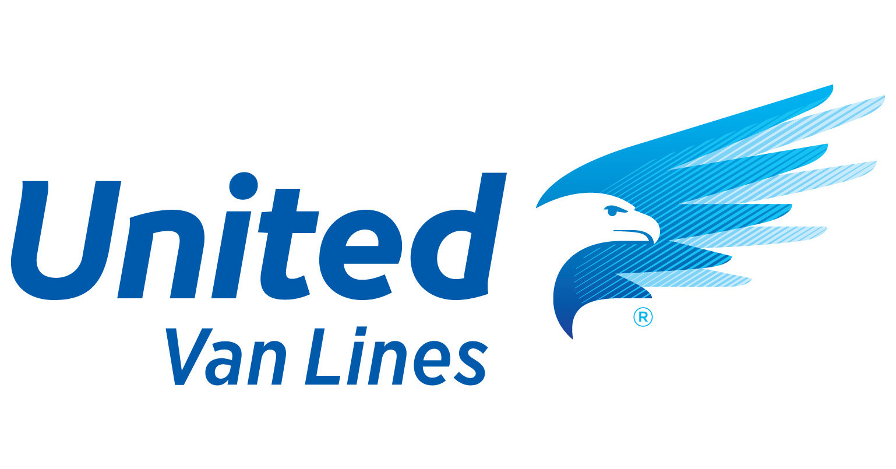

    UNIVERCIDAD NACIONAL DE INGENIERÍA
    
    FACULTAD DE INGENIERÍA ECONÓMICA ESTADÍSTICA Y CIENCIAS SOCIALES    
    Diseño y Analisis de Sistemas Practica N°3 
## UnitedVanLines Moving Company System

<!-- PROJECT LOGO -->
<br />
<div align="center">
  <a href="https://www.unitedvanlines.com/">
    
  </a>
  <h3 align="center">Nos Encargamos de Todo</h3>
  <p align="center">
    No transportamos mercancías, transportamos Sentimientos.
  </p>
</div>

<!-- TABLE OF CONTENTS -->
<details>
  <summary>Table of Contents</summary>
  <ol>
    <li>
      <a href="#about-the-project">About The Project</a>
      <ul>
        <li><a href="#built-with">Built With</a></li>
      </ul>
    </li>
    <li>
      <a href="#getting-started">Getting Started</a>
      <ul>
        <li><a href="#prerequisites">Prerequisites</a></li>
        <li><a href="#installation">Installation</a></li>
      </ul>
    </li>
    <li><a href="#usage">Usage</a></li>
    <li><a href="#roadmap">Roadmap</a></li>
  </ol>
</details>

```
sql.bsite.net\MSSQL2016
unitedvanlines_SampleDB
```
