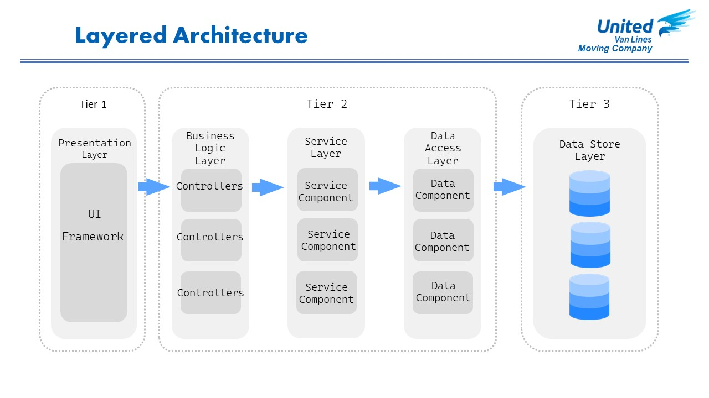
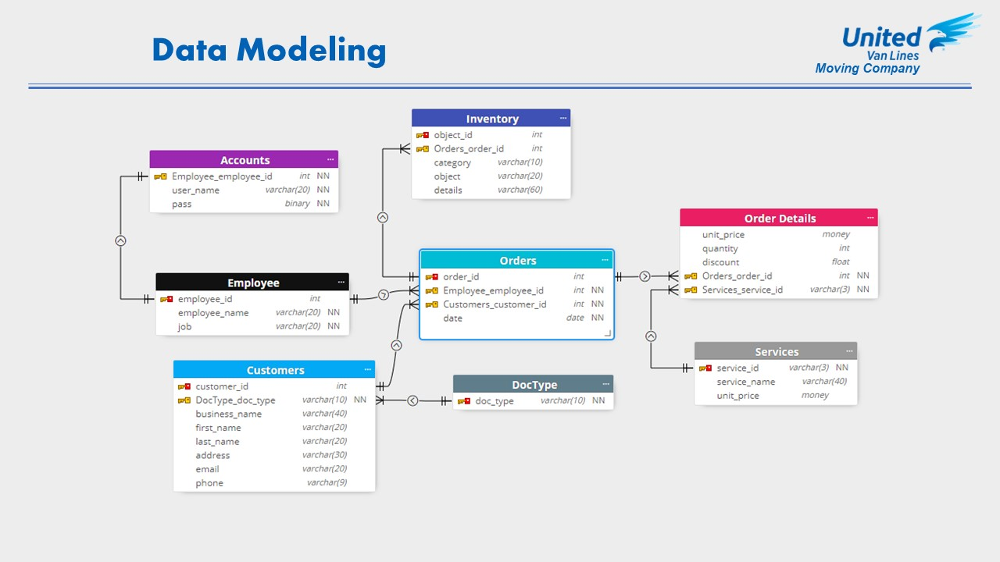

    UNIVERCIDAD NACIONAL DE INGENIERÍA
    
    FACULTAD DE INGENIERÍA ECONÓMICA ESTADÍSTICA Y CIENCIAS SOCIALES    
    Diseño y Analisis de Sistemas Practica N°3 
## UnitedVanLines Moving Company System

<!-- PROJECT LOGO -->
<br />
<div align="center">
  <a href="https://www.unitedvanlines.com/">
    
  </a>
  <h3 align="center">Nos Encargamos de Todo</h3>
  <p align="center">
    No transportamos mercancías, transportamos Sentimientos.
  </p>
</div>

<!-- TABLE OF CONTENTS -->
<details>
  <summary>Table of Contents</summary>
  <ol>
    <li><a href="#about-the-project">About The Project</a></li>
    <li><a href="#introduction">Introduction</a></li>
    <li><a href="#objectives">Objectives</a></li>
    <li><a href="#methodology">Methodology</a>
        <ul>
            <li><a href="#análisis-de-los-procesos">Análisis de los procesos</a></li>
            <li><a href="#diseño-de-la-arquitectura">Diseño de la arquitectura</a></li>
        </ul>
    </li>
    <li><a href="#kk">KK</a></li>
  </ol>
</details>

<!-- ABOUT THE PROJECT -->
## About The Project
El presente proyecto tiene como objetivo principal el desarrollo de un sistema de gestión que contribuya a agilizar el proceso de ventas en una empresa de mudanzas. El sistema propuesto permitirá optimizar la gestión de los clientes, la asignación de recursos y la planificación de las operaciones, con el fin de mejorar la eficiencia y la rentabilidad del negocio. A través de la implementación de esta solución tecnológica, la empresa podrá ofrecer un servicio más rápido y efectivo a sus clientes, brindando una experiencia satisfactoria que fortalezca su posición en el mercado.

**keywords:** `sistema de gestión`, `ventas`, `empresa de mudanzas`, `eficiencia`, `rentabilidad`, `recursos`, `planificación`, `experiencia del cliente`.

<!-- INTRODUCTION -->
## Introduction
En el sector de las empresas de mudanzas, la eficiencia en la gestión de las ventas y en la planificación de las operaciones es fundamental para garantizar el éxito del negocio. Sin embargo, muchas empresas aún utilizan métodos tradicionales y poco automatizados, lo que puede resultar en retrasos, errores y una experiencia insatisfactoria para los clientes. Con el objetivo de superar estas limitaciones, se plantea el desarrollo de un sistema de gestión que permita agilizar las ventas y optimizar los procesos internos de una empresa de mudanzas.

<!-- OBJECTIVES -->
## Objectives
* Diseñar e implementar un sistema de gestión que facilite el registro y seguimiento de los clientes, así como el control de las ventas.
* Desarrollar una interfaz intuitiva y fácil de usar que permita a los empleados gestionar eficientemente la información relacionada con las mudanzas y los clientes.
* Facilitar el proceso de facturación de los servicios ofrecidos.
* Brindar una experiencia satisfactoria a los clientes, ofreciendo un proceso de ventas ágil, transparente y personalizado.

<!-- METHODOLOGY -->
## Methodology
1. Análisis de los procesos de ventas y operativos de la empresa de mudanzas para identificar las áreas de mejora y los requerimientos del sistema.
2. Diseño de la arquitectura del sistema y de la base de datos, considerando las necesidades específicas de la empresa.
3. Desarrollo de las funcionalidades del sistema, como la gestión de clientes, cotizaciones, seguimiento de ventas, asignación de recursos y planificación de las operaciones.
4. Implementación de la interfaz de usuario, asegurando su usabilidad e intuitividad.
5. Pruebas exhaustivas del sistema para garantizar su funcionamiento correcto.

### Análisis de los procesos
<p float="center">
  
   
  
  
</p>

### Diseño de la arquitectura
<p float="center">
  
   
</p>

#### tools
<p float="center">
  
   
  
   
  
   
   
  
   
</p>


En el sector de lal sector de las empresas de mudanzas, la eficiencia en la gestión de las ventas y en la planificación de las operaciones es fundamental para garantizar el éxito del negocio. Sin embargo, muchas empresas aún utilizan métodos tradicionale
### Diseño de la arquitectura
En el sector de lal sector de las empresas de mudanzas, la eficiencia en la gestión de las ventas y en la planificación de las operaciones es fundamental para garantizar el éxito del negocio. Sin embargo, muchas empresas aún utilizan métodos tradicionalel sector de las empresas de mudanzas, la eficiencia en la gestión de las ventas y en la planificación de las operaciones es fundamental para garantizar el éxito del negocio. Sin embargo, muchas empresas aún utilizan métodos tradicionale


<!-- KK -->
## KK


Here's why:
* Your time should be focused on creating something amazing. A project that solves a problem and helps others
* You shouldn't be doing the same tasks over and over like creating a README from scratch
* You should implement DRY principles to the rest of your life :smile:

Of course, no one template will serve all projects since your needs may be different. So I'll be adding more in the near future. You may also suggest changes by forking this repo and creating a pull request or opening an issue. Thanks to all the people have contributed to expanding this template!

Use the `BLANK_README.md` to get started.

<p align="right">(<a href="#readme-top">back to top</a>)</p>


```
sql.bsite.net\MSSQL2016
unitedvanlines_SampleDB
```
